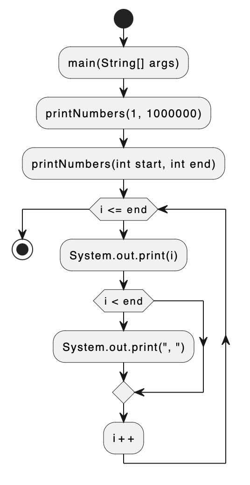

# Programa para Listar Números del 1 al 1 Millón

Este es un programa Java que lista de forma eficiente los números del 1 al 1 millón. Utiliza un algoritmo eficiente para generar esta secuencia de números de manera rápida y eficaz.

## Funcionalidades

- Generación eficiente de la secuencia de números del 1 al 1 millón.
- Utilización de un algoritmo optimizado para minimizar el tiempo de ejecución.
- Fácil ejecución y comprensión del código.

## Diagrama de Flujos

El diagrama de flujos muestra el proceso utilizado por el programa para generar la secuencia de números del 1 al 1 millón.

El diagrama de flujos se encuentra en el archivo `src/FlowDiagram-ListOfNumbers.png`.

